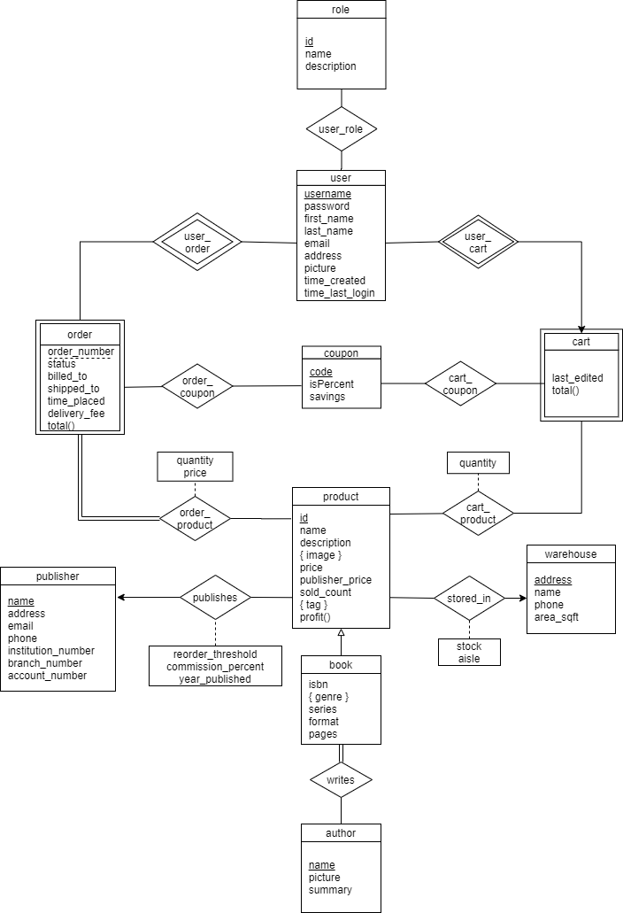
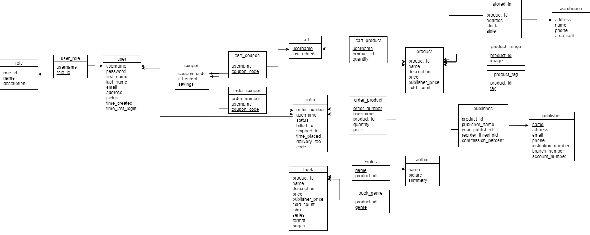

# SQL DDLs
## Design
### Entity-Relationship Diagram

### Schema Diagram

## Order
Since there are foreign key constraints, the files should be run in the following order:
1. product
2. author/book/warehouse
3. writes/stored_in/product_image/product_tag
