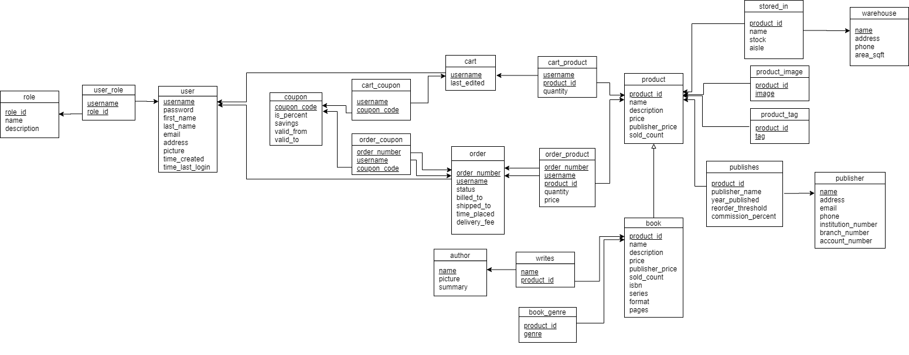

# SQL DDLs
## Design
### Entity-Relationship Diagram

### Schema Diagram

## Order
Since there are foreign key constraints, the files should be run in the following order:

### 1) Relations with no foreign keys
* author.sql
* book.sql
* coupon.sql
* user.sql
* product.sql
* publisher.sql
* role.sql
* warehouse.sql

### 2) Relations with only foreign keys on `user`
* order.sql
* cart.sql

### 3) Relations with only foreign keys on `book` or `product`
* book_genre.sql
* product_image.sql
* product_tag.sql

### 4) Relations with one or more foreign keys on any of the above relations
* cart_coupon.sql
* cart_product.sql
* order_coupon.sql
* order_product.sql
* publishes.sql
* stored_in.sql
* user_role.sql
* writes.sql
